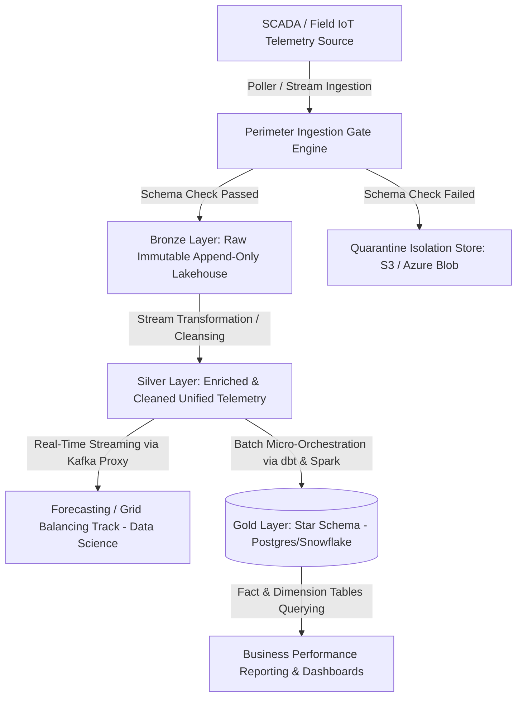
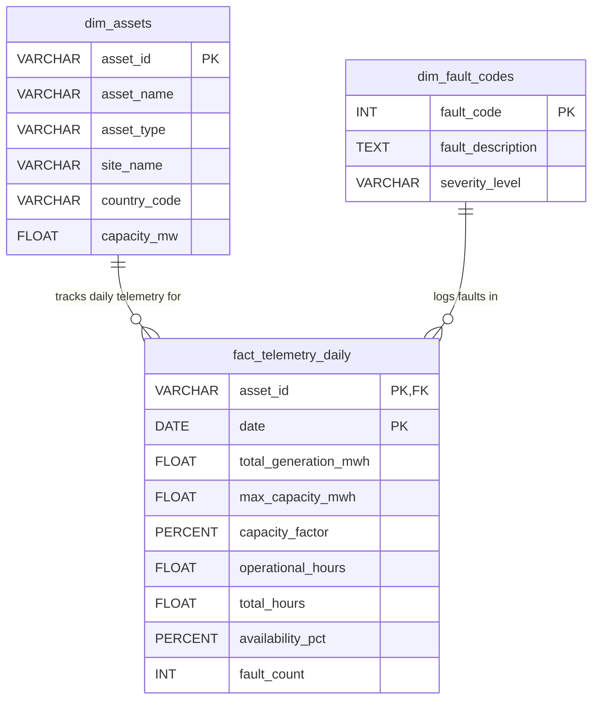

# RFC: High-Reliability SCADA & IoT Telemetry Architecture for BA Markets
**Author:** Dr.-Ing. Bushra Amin  
**Status:** Proposed / Proof-of-Concept Complete  
**Target Group:** MCP Data Agile Team, Vattenfall BA Markets  

---

## 1. Context
Vattenfall operates a geographically distributed fleet of wind and solar generation assets across Europe. These assets utilize field-level SCADA and IoT sensors that emit high-frequency telemetry over volatile industrial networks. This data is highly time-sensitive, commercially critical, and subject to grid-operator reporting obligations. 

Currently, this telemetry must simultaneously satisfy two conflicting consumer archetypes:
1. **Forecasting & Grid Balancing (Data Science / Low Latency):** Demands a near-real-time, low-latency stream of raw, high-fidelity readings to optimize trading decisions and mitigate imbalance penalties.
2. **Asset Performance & Reporting (Business Stakeholders / High Consistency):** Demands heavily aggregated, consistent, and audit-ready views to evaluate fleet availability, calculate capacity factors, and schedule predictive maintenance.

This RFC outlines a scalable, resilient Lakehouse architecture designed to ingest erratic SCADA data, apply robust perimeter validation, and bifurcate the data into specialized consumption layers without duplicating processing compute or engineering effort.

---

## 2. Goals / Non-goals

### Goals
* **Zero Downstream Degradation:** Intercept, quarantine, and flag the ~15% injected bad data at the absolute perimeter of ingestion before it touches downstream consumer models.
* **Dual-Track Serving Optimization:** Provide a sub-second, event-driven stream layer for forecasting engines while exposing a highly optimized, dimensional analytical star schema for business stakeholder ad-hoc querying.
* **Scale-Out Multi-Cloud Extensibility:** Design a system utilizing a standard Medallion Architecture that can support rapid spikes during weather events and allow a distributed team of 30+ engineers to incrementally add features using Git and Infrastructure as Code (IaC).
* **FAIR Alignment:** Enforce strict data contracts and automated schema versioning to ensure data is Findable, Accessible, Interoperable, and Reusable.

### Non-goals
* Imbalance settlement or direct financial accounting ledger management.
* Real-time remote control or write-back commands to physical SCADA controllers (Out of scope for ingestion pipeline).
* Ingestion of non-power generation assets (e.g., Hydro, Nuclear) for this specific MCP agile squad iteration.

---

## 3. Proposed Architecture

The system transitions from an event-driven, low-latency collection network to a decoupled structured Lakehouse model. Below is the systemic flow diagram:

### Architectural Breakdown
1. **Ingestion / Collection:** A lightweight, containerized Python engine mimics the polling frequency of the SCADA field system, consuming raw REST chunks or Kafka topics.
2. **Storage & Processing (Medallion Layout):**
   * **Bronze Layer:** Stores the raw, append-only JSON stream payload along with metadata capturing the ingestion timestamp and origin system markers to preserve absolute audit trails.
   * **Silver Layer:** Automatically applies data cleaning, converts irregular data records into unified datetimes, normalizes bidding zones, executes missing field flags, and removes duplicates.
   * **Gold Layer:** Builds an analytical star schema optimized for fast analytical queries, partitioning records logically by country, site, and date.
3. **Serving Layer Bifurcation:**
   * **Forecasting Track:** Consumes data streams straight out of the Silver Layer via low-latency Kafka topics or streaming materialized views to maintain sub-second freshness.
   * **Business Reporting Track:** Queries highly structured, denormalized Gold database tables, ensuring high-performance read speeds for heavy analytical dashboards.

---

## 4. Data Quality Handling

Based on historical data analysis, roughly 15% of incoming SCADA payloads present deliberate data-quality failures. The ingestion pipeline treats data quality as a first-class citizen using a **Reject, Quarantine, Correct, and Flag** framework:

| Data Quality Issue Identified | Ingestion Handling Protocol | Technical Justification |
| :--- | :---: | :--- |
| **Duplicate Readings** | **Reject & Deduplicate** | Using a combination of `asset_id` and unique `timestamp`, duplicates are dropped in the Silver layer using sliding-window deduplication to avoid double-counting power production. |
| **Missing/Null Fields** | **Correct & Flag** | For non-critical telemetry fields (e.g., panel temperature, blade pitch), the missing field is filled with a statistical placeholder or default value, and an internal data-quality flag bit vector (`is_imputed = True`) is attached to preserve data transparency. |
| **Out-of-Range Metrics** | **Quarantine & Alert** | Extreme physical violations (e.g., negative active power output, implausible wind speeds > 75 m/s) indicate sensor failure. The whole record is written to a **Quarantine Store** to protect downstream data consumer tracks, and an alert webhook is triggered. |
| **Orphan Asset IDs** | **Reject & Log** | Payloads containing an `asset_id` missing from the master Fleet Registry are isolated and rejected. This protects the core database layer from schema corruption and unmapped reporting allocations. |
| **Stale / Out-of-Order Data** | **Re-stream Partitioning** | SCADA payloads delayed by industrial field network drops are processed dynamically using watermarking and append-only event-time windows rather than system-arrival times. |

---

## 5. Data Modeling

To eliminate computation duplication, the architecture builds a robust Star Schema in the Gold analytical serving layer. This decouples static infrastructure asset variables from high-velocity operational telemetry metrics.

### Unified Dimensional Star Schema Design

* **`dim_assets` (Dimension Table):** Contains slow-moving dimensions mapping static asset properties (capacity, site location, asset type, country code).
* **`fact_telemetry_daily` (Fact Table):** A pre-aggregated, highly compressed table containing operational daily summaries per asset, tracking exact availability and capacity factors. This table directly answers strategic business stakeholder reporting questions with sub-second query execution times.

---

## 6. Handling the Two Consumer Types

| Consumer Matrix | Forecasting / Grid Balancing Track | Asset Performance & Reporting Track |
| :--- | :--- | :--- |
| **Primary Audience** | Data Scientists, Predictive ML Models | Asset Managers, Maintenance Teams, Traders |
| **Latency Requirement** | Near-Real-Time (Sub-second execution) | Batch-oriented (Hourly / Daily Refresh) |
| **Data Granularity** | Raw, high-fidelity, un-aggregated metrics | Highly structured, denormalized, aggregated facts |
| **Access Pattern** | Asynchronous stream consumption via Event Streams | Standardized analytical SQL queries, BI dashboards |
| **Freshness Priority** | Maximizing velocity over absolute consistency | Maximizing data completeness and audit accuracy |

---

## 7. Scale & Reliability

The system addresses the core constraints of the problem statement using three foundational engineering guardrails:
1. **Handling Spike Volatility:** The ingestion layer is completely stateless and containerized within **Docker and Kubernetes (AKS)**. When high-wind or seasonal weather events trigger massive data surges, the ingress microservices scale horizontally, using **Apache Kafka** to safely buffer and smooth the traffic spikes before writing to the database.
2. **Modular Team Extension:** The code architecture strictly isolates the Ingestion Ingress Layer, the Data Cleansing Modules, and the Reporting Views into distinct Python packages. Over 30 engineers can work concurrently on separate features by utilizing branch governance rules inside **GitHub** without causing merge or script execution regressions.
3. **Idempotency Guarantee:** Every step of the transformation and ingestion workflow is completely idempotent. If a system failure or crash occurs mid-run, the pipeline can be safely executed repeatedly over the same data window without generating duplicate metrics or corrupting the core data layer.

---

## 8. Compliance & Data Sensitivity

Even though SCADA telemetry does not contain Personally Identifiable Information (PII), it represents highly sensitive, market-informing operational assets. Leakage or unauthorized tampering poses severe trading risks and compliance regulatory threats.
* **Network Isolation:** All database instances and storage lakehouse boundaries operate inside isolated private subnets, allowing access only via authenticated enterprise API tokens.
* **Data Encryption:** Enforces complete encryption-at-rest (using AES-256 standards) and encryption-in-transit (using TLS 1.3 metrics) across all streaming and persistence channels.
* **Audit Trails & Security Vetting:** Every row in the data layer is stamped with its exact ingestion metadata history. This immutable auditing strategy ensures compliance with grid-operator reporting obligations and aligns with the security vetting standards required by Vattenfall's critical national infrastructure status.

---

## 9. Tradeoffs & Alternatives Considered

### Alternative A: A Single, Real-Time Unified Streaming Database (e.g., TimescaleDB for everyone)
* **Why it was rejected:** While attractive, forcing business analysts to write heavy, multi-layered aggregation SQL queries directly against raw, high-frequency time-series streams degrades query execution speeds for operational dashboards and introduces significant lock contention risks against the incoming real-time streaming engines.

### Alternative B: The Chosen Decoupled Lakehouse (Delta Lake + Postgres/Snowflake Serving)
* **Why it was selected:** It cleanly isolates the computational workloads. Data scientists extract low-latency, raw telemetry streams out of the Silver staging pool without query lag, while business users run fast, optimized aggregate queries on the Gold Star Schema tables. This maximizes resource isolation and efficiency.

---

## 10. What I'd Do Differently With More Time
* Implement a robust, distributed data contract validation network utilizing advanced **Great Expectations** configurations or strict **Pydantic v2** validation boundaries.
* Introduce a fully integrated **dbt (Data Build Tool)** pipeline layer to manage the documentation, semantic lineage, and automatic data quality testing of the star schema migrations.
* Integrate a real-time alerting engine that uses automated machine learning anomaly checks to proactively flag unexpected physical asset degradation before a fault code is ever thrown.

---

## 11. Reporting Optimization & Interactive Dashboard (Standout Initiative)
To satisfy the requirements of our Business Stakeholders and go beyond raw database querying, this Proof-of-Concept includes an automated, low-latency reporting dashboard engineered in **Streamlit**. 

* **Why this approach was adopted:** Rather than forcing users to interface directly with SQL clients, this layer maps our Gold Star Schema metrics (`dim_assets` and `fact_telemetry_silver`) into high-utility charts and tables in real time. It serves as a visual framework for the analytical views used by asset managers and traders, demonstrating the commercial readiness of our serving design.
* **Verified Runtime Output:** Initial live monitoring profiles confirm seamless rendering across all core metrics—tracking exact fleet availability variables (e.g., Boel Wind Farm, DanTysk, Haringvliet Solar), capturing specific fault-code frequencies (such as GEARBOX_VIBRATION and OVERTEMP), and bifurcating country generation data without performance degradation.

